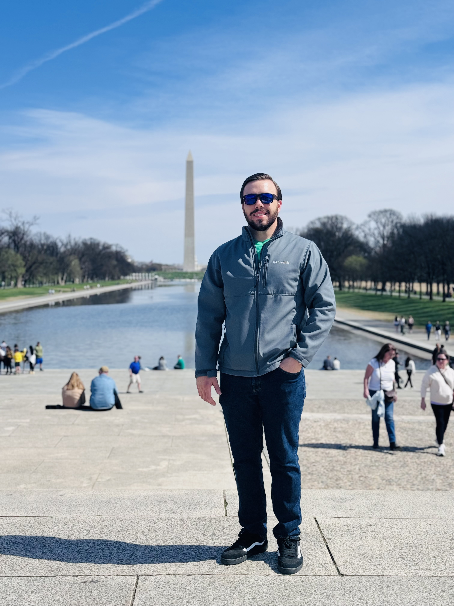

## Meet Dalton Stubbs, Network Engineer

Dalton Stubbs brings over 7 years of experience in designing, implementing, and optimizing complex networking infrastructures, primarily within the Department of Defense (DoD). With expertise in both traditional networking and cutting-edge automation technologies, Dalton ensures the efficiency, security, and reliability of critical networks.

## Key Expertise and Certifications

Dalton holds certifications including CCNP Enterprise, DevNet Associate, CASP+ (CompTIA Advanced Security Practitioner), Azure Fundamentals, CCNA, Sec+, and a Bachelors of Science in Cybersecurity Management and Policy. This diverse skill set enables Dalton to navigate modern networking challenges confidently, with a strong focus on security protocols.

## Innovation and Leadership

Throughout Dalton’s career, they have led innovative efforts, leveraging automation tools to streamline operations and enhance cybersecurity. Dalton is not only a technical expert but also a collaborative leader known for inspiring teams and driving results in high-pressure environments.

## Commitment to Excellence

With a dedication to staying updated on emerging technologies and industry best practices, Dalton remains at the forefront of network engineering excellence. Their proven track record in delivering tangible outcomes makes them an indispensable asset in safeguarding DoD’s network infrastructure.

<!--- ### My story

To be honest, I'm having some trouble remembering right now, so why don't you just watch [my movie](https://en.wikipedia.org/wiki/The_Princess_Bride_%28film%29) and it will answer **all** your questions. -->
